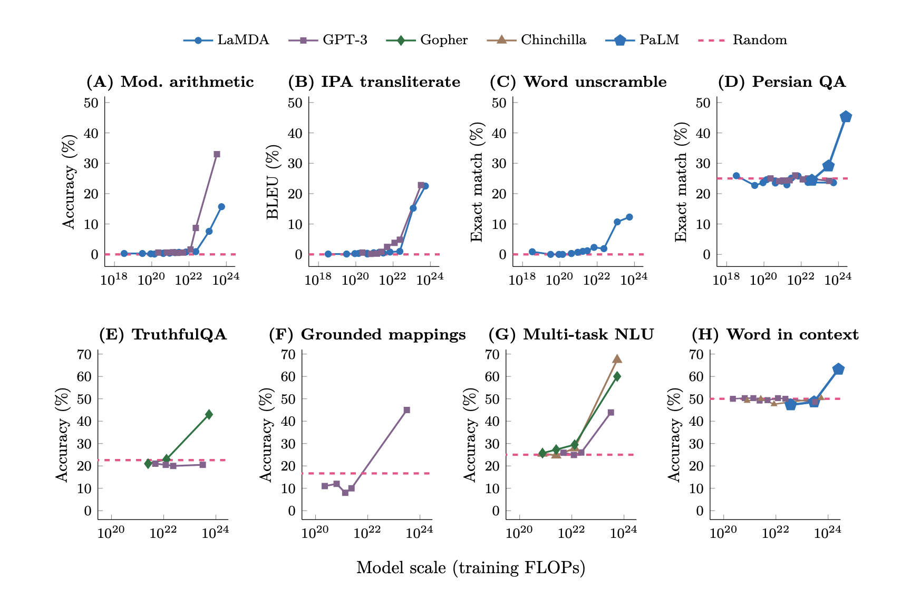

# learning-LLM
Codes and Notes while learning Large Language Model

## LLM & GPT
- 大型語言模型 Large Language Model, LLM
    - LLM 是指「參數量 `parameters`」在數十億或更大量級的深度學習模型。

- 生成式預訓練模型 Generative Pre-trained Transformer, GPT
    - GPT 是一種大型語言模型 (LLM)。
    - 根據輸入的一段文字向量，產生另一段文字向量的結果。輸出結果和輸入是不等長的，且輸出具有隨機性。
    - 常用詞，如 `logit` (隨機性)、`prompt` (輸入)、`completion` (輸出)、`token` (字詞)。
---

Reference: [E2B.dev, Cloud Runtime for AI Agents](https://x.com/tereza_tizkova/status/1769728977529197018/photo/1)

- 以《快思慢想》來比喻，LLM 擅長記憶背誦，但不擅長邏輯推理。
    - [快思慢想 Thinking, Fast and Slow](https://en.wikipedia.org/wiki/Thinking,_Fast_and_Slow) 為 2002 年諾貝爾經濟學獎得主 Daniel Kahneman 於 2011 年出版的暢銷書。
    - 書中將人類的思維歸納為兩大思考模式，系統一快速且情緒化的直覺思考，系統二具邏輯推理的理性思考。

- 現行 LLM/GPT 的極限或瓶頸是什麼？
    - 雖然可以長期記憶大量文本（記憶力強），但短期記憶力不好；簡言之，只記得住以前學過什麼，記不住現在教他的內容。
    - 雖然想得快，但無法更新資料庫、無法上網搜尋；因此只能回答教科書上的老問題，無法回答時事、新問題。
    - 雖然反應快，但只能根據教科書上學過的內容做出應答，無法超出範圍做其他應用服務。

## AI & Data Science
- 資料科學 = 從資料中找關係
- 現代資料科學 = 大數據 + 機器學習
- 人工智慧 = 利用電腦程式模仿人類的行為
- 類神經網路 = 用數學模型模仿人類大腦的結構
- 深度學習 = 以類神經網路為架構，對資料做「維度轉換 / 特徵學習 / `Kernel Method`」的演算法

Reference: [Artificial Intelligence & Data Science interactions.](https://www.mdpi.com/2078-2489/14/6/345)

---

- AlphaGo v.s. GhatGPT
    - AlphaGo 和 GhatGPT 都是深度學習。
    - AlphaGo 只適用特定領域，GhatGPT 則適用於泛用領域。

- 人工智慧 Artificial Intelligence, AI 派系的演變？
    - 符號理論學派 Symbolists：規則 Rule-Based，專家系統 Expert System。
    - 演化論學派 Evolutionaries：仿生，遺傳演算法 Genetic Algorithm。
    - 貝氏定理學派 Bayesians：統計，簡單貝氏、馬可夫鏈。
    - 類比推理學派 Analogizers：幾何相似、機器學習 Machine Learning，KNN、SVN、迴歸 Regression。
    - 類神經網路學派 Connectionists：腦科學、深度學習 Deep Learning，類神經網路 Neural Networks。

- 機器能夠思考嗎？
    - 「思考」很難定義。
    - 可以用「圖靈測試 Turing test」來衡量機器的智能。

- Emergent Abilities of Large Language Models.
    - Emergent Abilities：湧現能力、頓悟、開竅。
    - 當模型訓練資料量大到某程度時，模型準確度會突然有跳躍性的大提升。
    - 當模型規模達到某個閾值時，模型對某些問題的處理性能呈現快速增長。
    - 有愈多的資料量，就會有愈多的參數量，模型結果就會愈準確。

    
    Reference: [Emergent Abilities of Large Language Models](https://openreview.net/pdf?id=yzkSU5zdwD)

    
    Reference: [Like ChatGPT? You Haven’t Seen Anything Yet](https://www.datanami.com/2023/02/03/like-chatgpt-you-havent-seen-anything-yet/)

- History of Natural Language Processing.
    - Word2Vec >> Transformers >> BERT >> ChatGPT ...

- AI 產業的發展符合「萬物摩爾定律 Moore's law」。
    - 表示每隔 18 個月，就會有一個全新的改版，或是顯著性的效能提升。
    - 摩爾定律原指每隔 18 個月，積體電路上可容納的電晶體數目便會增加一倍，或是晶片的效能提高一倍。

- AI 可以幫助人類找到最佳解，但無法替人類做決定。
    - 數據 data + 資訊 information = 數位化
    - 數據 data + 資訊 information + 知識 knowledge = 人工智慧
    - 數據 data + 資訊 information + 知識 knowledge + 經驗 experience + 決策 decision = 資料科學

- Kill Application? ChatGPT.

## OpenAI ChatGPT API
- ChatGPT 是用於「聊天」的生成式語言模型。
- ChatGPT 三大特性：
    - 隨機：
        - 對於同一個問題，在不同的對話中可能會給出不同的答案。
        - 若問題是有標準答案的，ChatGPT 有可會會隨機亂回答，故它可能不是最好的選擇。
    - 接龍：
        - 根據上下文預測下一個字的機率，選擇機率最大/過去最常出現的文字，接龍出句子。
        - 容易受到訓練資料的影響，會因為錯誤訓練資料的干擾，而有錯誤的歸納/推理。
    - 胡謅：
        - ChatGPT 的訓練資料十分廣泛，能夠回答各種領域的問題。
        - 但它可能會胡說八道，生成看似合理但實際上不準確或錯誤的信息。
        - 當它無法正確理解上下文、常識或時事，可能會導致不合適或不相關的回答。

- 提示工程 Prompt Engineering?
    - 是一種透過設計、引導、改進、優化的方式來提升 AI 產生出來的結果，使其更加的準確且可靠的執行任務。
    - 簡言之，就是「做出好的提問」。

- 模型 model?
    - 是從資料中學習規則的黑盒子。
    - 黑盒子內部是基於數學所構建出來的算法。

- ChatGPT 角色架構：
    - System role
        - The system role sets the behavior of the assistant.
        - 幫助 User 把需求說清楚，描述 Assistant 所要扮演的特性，包含「背景、角色、條件、限制」。
    - Assistant role
        - ChatGPT (LLM) receives the prompt and returns the completions.
        - 就是 AI，就是 ChatGPT。
    - User role
        - The user (You) sends the prompts and receives the completions.
        - 就是我們。

- Token
    - Token 通常指的是文字處理過程中的最小單位。
    - Token 是模型視角中的單字，可以是字符、詞語、片語、句子或其他較小的文字單元，取決於模型的設計。
    - Tokenization 是將一段連續的文字序列拆分為 Token 的過程。

     
    Reference: [How Does ChatGPT Work?](https://www.baeldung.com/cs/chatgpt-model)

- Embedding
    - Embedding 是將離散的文字資料轉換為連續的、低維度向量。
    - Embedding 是把人類的語言轉換成電腦看得懂的語言或意思。

     
    Reference: [Unveiling the Secrets of ChatGPT: How Embeddings Revolutionize AI Language Understanding](https://jeremyjouvance.medium.com/unveiling-the-secrets-of-chatgpt-how-embeddings-revolutionize-ai-language-understanding-cf46b7c49963)

- LLM 優化技法?
    - Prompt Engineering >> RAG >> Fine-tuning >> Train from Scratch

    
    Reference: [ChatGPT 任務指令萬能模板](https://chatgptprompt.cc/666.html)
    
    Reference: [如何優化 LLM 的效果](https://www.breezedeus.com/article/make-llm-greater)

- 傳送門
    - [ChatGPT API Introduction](https://platform.openai.com/docs/api-reference/introduction)
    - [ChatGPT API Example](https://platform.openai.com/docs/quickstart?context=python)
    - [ChatGPT API Playground](https://platform.openai.com/playground?mode=chat)
    - [ChatGPT API Tokenizer](https://platform.openai.com/tokenizer)

## ChatGPT API + LINE ChatBot

## LangChain Framework

## Embeddings & Vector Database
- Embeddings
- 向量資料庫 Vector Database
    - 在本地端做特徵工程建向量資料庫，本身就是一種 RAG 的展現方式。

## GPT Function Calling

## RAG + Agents
- RAG
    - 檢索增強生成 Retrieval-Augmented Generation
- Agents

## 範例程式
- [01_openai_libs.ipynb](codes/01_openai_libs.ipynb): test OpenAI Python library
- [02_chatgpt_api.ipynb](codes/02_chatgpt_api.ipynb): integrate ChatGPT API
- [03_chatgpt_with_linechatbot.ipynb](codes/03_chatgpt_with_linechatbot.ipynb): integrate ChatGPT into Line Chatbot
- [04_langchain.ipynb](codes/04_langchain.ipynb)
